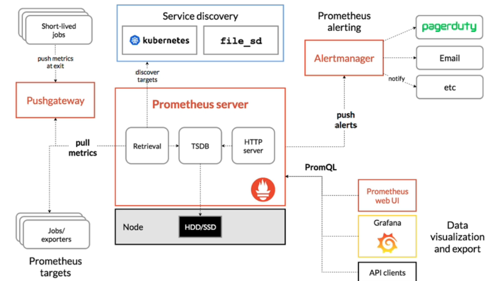

# Prometheus
- 오픈 소스 모니터링 솔루션
- 메트릭을 추적하고 그에 따른 알람 기능 제공
- 구글의 Borgman에서 영감을 받은 솔루션

 

### Prometheus의 특징
- PromQL이라는 Filxible Query Language를 포함함 (READ only Language)
- Built-in expression Browser를 사용하여 시각화가 가능함
- Grafana와 함께 사용할 수도 있음
- 수집된 모든 메트릭은 메모리 혹은 로컬 디스크에 효율적인 형태로 저장됨
- Go언어로 작성되었음

 

### Prometheus의 구조

* 프로메테우스 서버에서 end-point를 통해 클라이언트에서 데이터를 불러옴 (pull metrics)
* 불러온 데이터를 HDD/SDD에 저장
* Alertmanager를 활용하여 경고 및 알람을 보낼 수도 있음
* PromQL을 사용하여 데이터를 내보내 웹 UI 혹은 Grafana로 시각화된 결과를 보여줄 수 있음

 

**Prometheus Server**
* 모니터링 타겟을 HTTP end-point를 통해 모니터링 "데이터"를 긁어옴 (각 타겟에서 필요한 데이터만!)
* 긁어온 데이터를 토대로 모니터링
* 초당 최대 백만개의 타임 시리즈 데이터를 긁어올 수 있음

**Prometheus PushGateway**
* 배치 혹은 단기로 이뤄짐으로써 짧게 존재하는 데이터를, 프로메테우스 서버가 긁어갈 수 있도록 데이터가 좀 더 오랫동안 존재할 수 있게 해줌
* 해당 데이터들을 프로메테우스 서버에 노출시켜 서버가 긁어가게 함

**Exporters and Intergrations**
* 서드파티 시스템을 통해 데이터를 프로메테우스 메트릭으로 수집할 수 있게 해줌
* 프로메테우스 서버가 직접적으로 계측할 수 없는 데이터들도 수집할 수 있게 함 (예: HAProxy, Linux System stats)

**Prometheus Alertmanager**
* 클라이언트 앱이 보내는 경고를 처리하거나, 프로메테우스 서버에서 보내는 알람을 전송시킬 수 있음
* 알람 복제, 그룹핑, 라우팅이 가능함

**Service Discovery**
* end-point를 찾아서 메트릭 데이터를 긁어가게 해줌
* prometheus.yaml 파일을 구성하여, 데이터를 긁어올 엔드포인트를 알려주고, 수행할 잡을 커스터마이징

**PromQL**
* Prometheus Querying Language
* 그래프로 결과를 내보내거나 HTTP API로 내보낼 수도 있음

 

### Prometheus Metric and Type
* 4 core metric Type (Counter, Gauge, Histogram, Summary)

**Counter**
* cumulative metric (only increasing or zero)
* ex: number of requests, task completed, errors

**Gauge**
* singel numerical value (can up or down)
* ex: memory usgae, cpu temperatures

**Historgram**
* sample observation
* provide sum of all observerd value
* ex: request duration, reponse size

**Summary**
* summary samples observation (similary to histogram)
* total count of observations
* ex: request durations, reponse size

### 프로메테우스 실습
실습 참고 링크: [Complete-MLOps-Bootcamp](https://github.com/manifoldailearning/Complete-MLOps-BootCamp/tree/main/Continuous-Monitoring-Prometheus-Grafana)
1. AWS EC2 인스턴스 생성
2. 인스턴스의 모든 포트를 노출 (IPv4, IPv6) 
3. 터미널에서 SSH를 사용하여 EC2에 연결
4. 스크립트 작업
   1. 관리자 계정으로 로그인 ``sudo su -``
   2. 깃 설치확인 ``git --version``
   3. 깃 레퍼지토리 클론 받기 ``git clone <주소>``
   4. 스크립트 실행하기 ``chmod u=rwx,g=r,o=r 1-install.sh``
   5. 프로메테우스 실행하기 ``sudo service prometheus start``
   6. 프로메테우스 실행상태 확인하기 ``sudo service prometheus status``
5. 작업을 명시해주는 prometheus.yaml 파일 내용 확인하기
   1. scrape_interval: 데이터를 긁는 시간 주기
   2. evaluation_interval: 데이터 평가 시간 주기
   3. alerting: alertmanager 관리
   4. scrape_configs: 데이터를 긁어낼 타겟을 구성 (최소한 자기 자신은 항상 바로 모니터링하도록 함! 9090 포트를 사용)
   5. localhost:9090/metrics으로 가면 어떤 지표를 모니터링하고 있는지 확인할 수 있음
   6. job_name 등을 설텅해서 라벨을 달아줄 수 있음 (9090 대시보드에서 편하게 볼 수 있음)